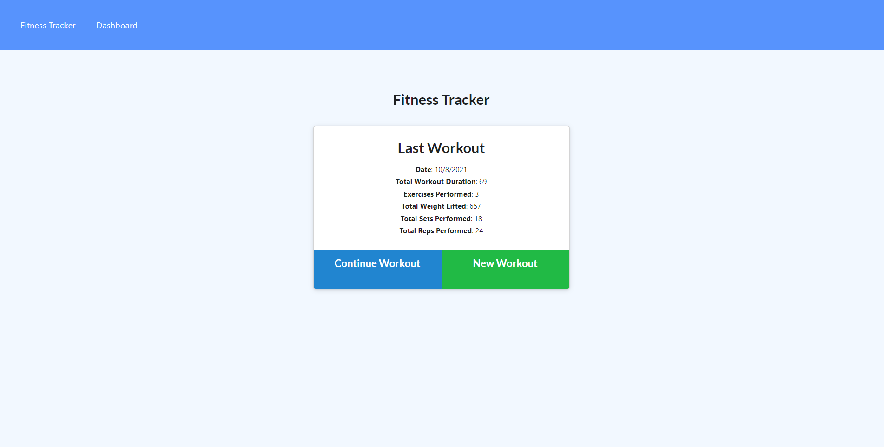
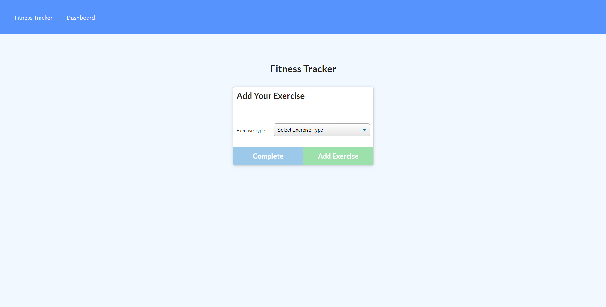
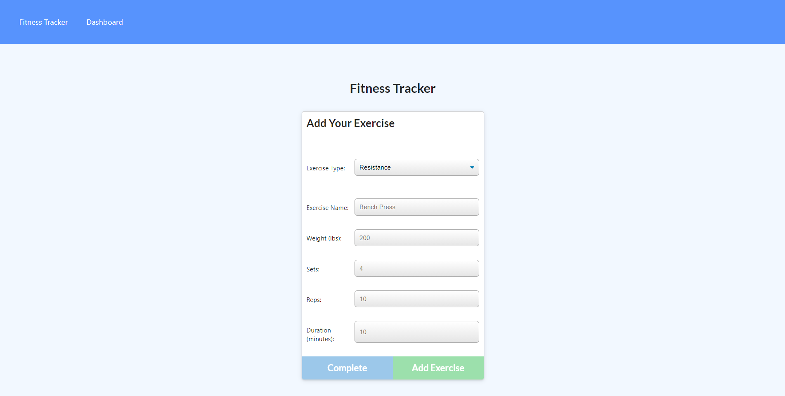
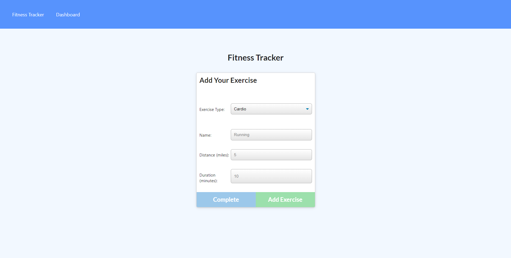
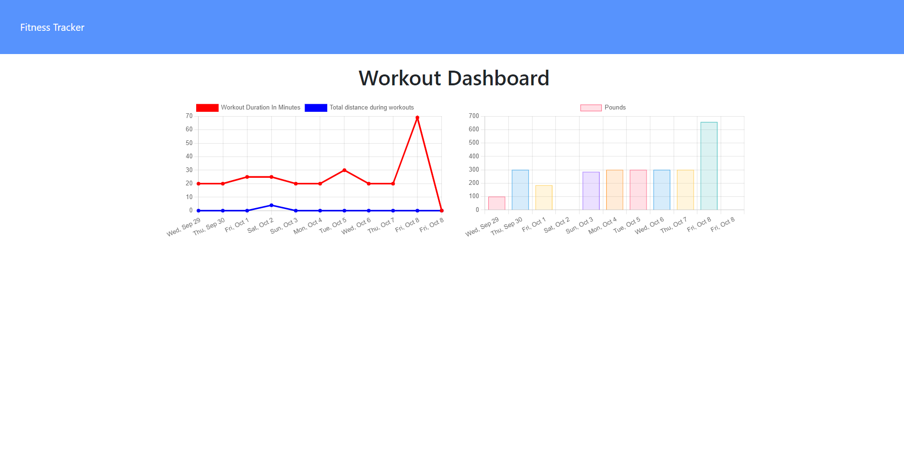

# MongoDB Fitness Tracker

## Table of Contents

- [Description](#description-)
- [Licenses](#licenses-)
- [Installation](#installation-)
- [Usage](#usage-)
- [Technologies](#technologies-)
- [Screen shots](#screen-shots-)
- [Credits](#credits-)
- [Contributions](#contributions-)
- [Questions](#questions-)


## Description : 
This a full stack web app that uses MongoDb as it's database and was created using mongoose npm package. This app follow the javaScript MVC paradigm design and uses node, express and the mongoDB Atlas for the db hosting.

## Licenses :
[](https://opensource.org/licenses/MIT)


[Click here to see the running MongoDB Fitness Tracker!](https://cryptic-stream-26960.herokuapp.com/)


## Installation : 
To install the MongoDB Fitness Tracker App use the instructions bellow &#8595;
```
npm install
```


## Usage : 
User can track their workout reps, distance, weight and more. All of this information will be saved to database and user could view as line or bar charts to see their progress.

## Technologies : 

-  MongoDb.
-  Mongoose.
-  MongoDB Atlas.
-  JavaScript.
-  HTML.
-  CSS.
-  Semantic CSS Framework.
-  Chart.js.

## Screen shots : 
### Here are screen shots of my deployed MongoDB Fitness Tracker App!


## Credits :

- [Muiasr-Al-Ani](https://github.com/Muiasr-Al-Ani)


## Contributions :
    Contributions, issues, and feature requests are welcome!
    Give a ⭐️ if you like this project!


## Questions : 
If you have any Question please feel free to contact me:
- muiasar2012@gmail.com
- [Muiasar-Al-Ani](https://github.com/Muiasar-Al-Ani)


&copy; 2021 [MongoDB Fitness Tracker](https://github.com/Muiasar-Al-Ani)
